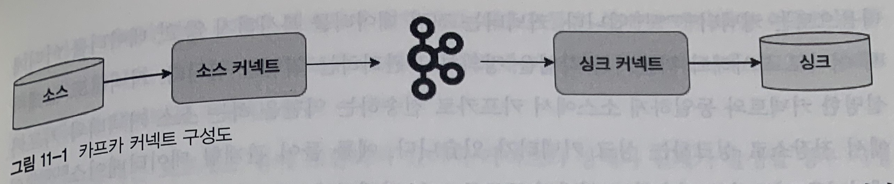
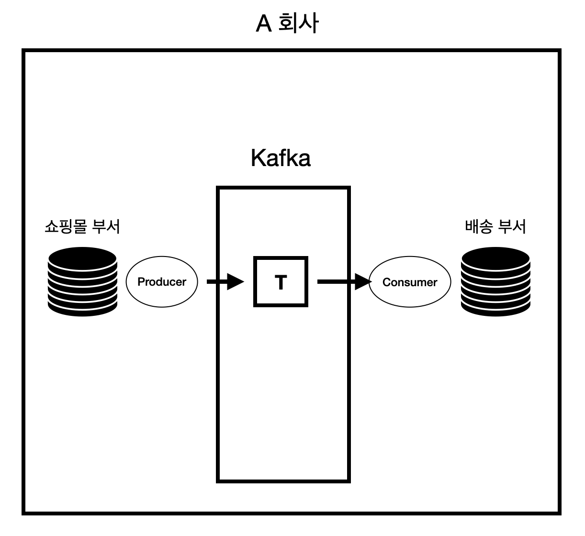

# 카프카 커넥트

- 카프카 커넥트의 핵심개념
- 카프카 커넥트의 내부 동작
- 단독 모드 카프카 커넥트
- 분산 모드 카프카 커넥트

## 카프카 커넥트의 핵심개념
- 카프카 커넥트는 오픈소스 프로젝트중 하나로 외부시스템과 카프카를 손쉽게 연결하기 위한 프레임워크.
- 커넥트의 주요 장점

1. 데이터 중심의 파이프라인 
2. 유연성과 확장성
3. 재사용성과 기능 확장
4. 장애 및 복구
- 커넥터는 프로듀서 역할을 하는 소스커넥터 와 컨슈머 역할을 하는 싱크 커넥터 2가지로 나뉜다.

## 카프카 커넥트의 내부 동작

- 카프카 커넥트는 내부적으로 워커 단위로 이루어져있다. 워커는 카프카 커넥트 프로세스가 실행되는 서버 또는 인스턴스를 의미한다. 이러한 워커 내부는 커넥터와 테스크로 이루어져있다.
    - 커넥터 : 데이터를 어디에서 어디로 복사하는지를 담당
    - 테스크 : 커넥터가 정의한 작업을 직접 수행
- 카프카 커넥트는 다수의 커넥터와 다수의 테스크를 지닐 수 있는 워커를 한 개 또는 여러 개를 가지며 아키텍쳐를 형성하고 데이터를 처리한다.
- 단일 워커일 경우 단일모드 , 다수의 워커일 경우 분산 모드라고 할 수 있다.

## 단일 모드 커넥터
  - 1개 프로세스만 실행되는점이 특징
  - 고 가용성 구성이 되지 않아 단일장애점(Single Point Of Failure)가 될 수 있다.
  - 따라서 단일 모드 커넥트 파이프라인은 주로 개발환경이나 중요도가 낮은 파이프라인을 운영할 때 사용
## 분산 모드 커넥터
- 2대 이상의 서버에서 클러스터 형태로 운영함으로써 단일 모드 커넥트 대비 안전하게 운영할 수 있다.
- 데이터 처리량의 변화에도 유연하게 대응할 수 있는 스케일 아웃을 지원한다.
- 따라서 상용환경에서 무중단 운영을 하길 원한다면 분산 모드 커넥트를 2대 이상 구성하고 설정하는 것이 좋다.
- REST API를 사용하면 현재 실행중인 커넥트의 플러그인 종류, 태스크 상태, 커넥터 상태등을 조회할 수 있다.

- 커넥터 흐름도

