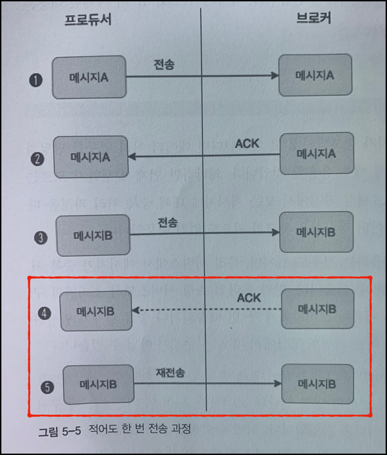
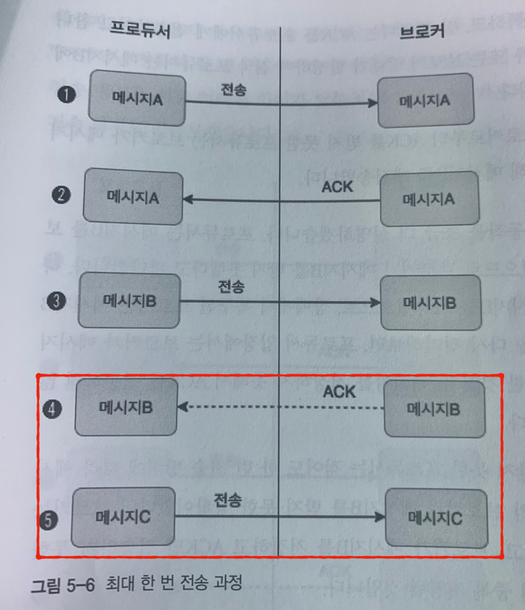
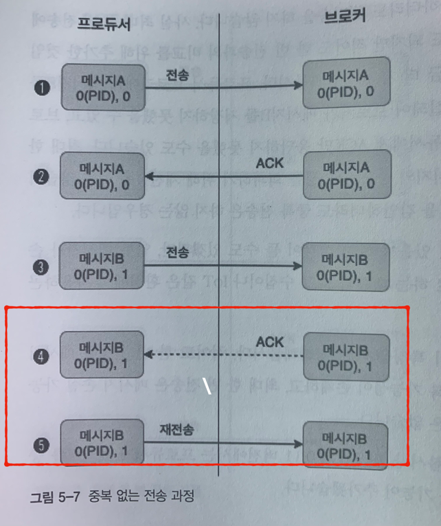

# 프로듀서의 내부동작 원리와 구현

### 1.프로듀서 동작원리

- 기본적으로 프로듀서가 전송하려는 메세지들은 프로듀서의 send() 메소드를 통해 시리얼라이저, 파티셔너를 거쳐 카프카로 전송하게 된다.

### 2. 파티셔너

- 2-1. 프로듀서는 토픽으로 메세지를 보낼때 해당 토픽의 어느 파티션으로 보내야할지 결정해야하는데 이때사용하는 것이 파티 셔너이다.

- 2-2 파티셔너는 기본적으로 메시지의 키를 해시로 처리해 어느 파티션으로 보내는지 결정한다.

- 2-3. 메시지의 키값이 동일하면 해당메시지들은 모두 같은 파티션으로 전송된다.

- 2-4 메시지의 키를 이용해 메시지를 전송하기 떄문에 되도록이면 파티션수를 변경하지 않는 것을
권장함

### 라운드 로빈 전략 & 스티키 파티셔닝 전략

#### 라운드 로빈 전략
- 2-1 메시지의 키값은 필수값이 아니므로 null값이 들어올경우는 기본값인 RR알고리즘 전략을 사용하여 레코드를 랜덤 전송합니다.

- 2-2 RR전략은 메시지는 배치전송을위해서 설정한 레코드 전송수를 충족하지못하면 프로듀서 내부에 계속 대기를 해야하는 단점이 있다.

#### 스티키 파티셔닝 전략

- 2-3 RR전략의 단점은 보완하여 나온 스티키 파니셔닝 전략으로 하나의 파티션에 레코드 수를 먼저 채워서 빠르게 배치전송하는 전략.
카프카 2.4버전에서부터 출시.

- 2-2 속도 차이가 미미한거 처럼 느낄수있지만 RR로빈 전략보다 30프로이상 지연시간이 감소, 카프카에서는 스티키 파티셔닝 전략을 권장.

#### 프로듀서의 배치

- 배치 전송의 옵션

   - Buffer.memory : 카프카로 메시지들을 전송하기위해 담아두는 프로듀서의 버퍼 메모리 기본값은 32MB.
   - batch.size : 배치전송을위한 배치 크기옵션. 기본값은 16KB로 설정.
   - linger.ms : 버퍼메모리에서 메시지들의 대기시간을 설정하는 옵션. 기본값은 0, 기본값으로 설정시 메시지들이 즉시 전송

- 처리량위주 전송 : bacth.size와 linger.ms값을 크게 설정 권장
- 지연없는 전송 : bacth.size와 linger.ms값을 작게 설정 권장

- 높은 처리량을 목표로 배치전송을 설정하는 경우는 버퍼 메모리의 크기가 충분히 커야한다.
버퍼메모리  = 배치 사이즈의 설정값 X 파티션의수 이상은 필요함.

#### 메시지 전송방식

- 3-1 메시지 전송방식 4가지
   - 중복없는 전송
   - 적어도 한 번 전송
   - 최대 한 번 전송
   - 정확히 한 번 전송

- 적어도 한 번 전송
   - 네트워크 장애나 기타 상황에 따라 일부 메시지 중복이 발생할수 있지만, 최소한 하나의 메시지는 반드시 보장한다는 것이 “적어도 한 번 전송” 방식이며 카프카는 기본적으로 이와 같은 적어도 한 번 전송 방식을 기반으로 동작한다.
   - 4번 : 브로커는 메시지 B를 기록하고 잘받았다는 ACK를 전송하는 과정에서 오류 발생시
   - 5번 : 메시지 B는 브로커로 부터 ACK를 받지 못했기 때문에 다시 메시지 B를 재전송

   - 브로커가 메시지B를 저장하고 장애발생시 브로커는 재전송받은 메시지B를 한번더 저장하기 때문에 중복저장이 될 가능성이 있다.

- 최대 한 번 전송 
   - 최대 한 번 전송 과정에서 프로듀서는 메시지의 중복 가능성을 회피하기 위해 재전송을 하지 않는다. ACK를 응답받지 못하여도 다음 메시지를 전송하여 중복 가능성을 배제함.
   - 높은 처리량을 필요로하는 대량의 로그 수집이나 IoT환경에서는 최대 한 번 전송 방식을
사용함.

   - 4번 : 프로듀서에서 메시지 B에 대한 ACK응답을 받지 못함.
   - 5번 : 프로듀서는 다음 메시지인 C를 전송함

   - 메시지의 손실을 감안 하더라도 중복 메세지를 배제하기위한 전송 방식.

- 중복없는 전송
   - 메시지에 PID라는 고유 번호를 포함해서 전송하는 방법으로 브로커에서 장애가 발생해서 ACK응답을 못받아도 재전송시 PID 검증을 통하여 중복을 방지한다.
   - 중복을 피하기 위한 PID비교동작에는 오버헤드가 존재할 수 밖에 없다.
   - 프로듀서의 전송 성능에 부담에 없는 상황이라면 중복없는 전송 방식을 권장.

- 정확히 한 번 전송
  - 카프카에서는 정확히 한 번 처리를 담당하는 별도의 프로세스가 존재하며 이를 트랜잭션 API라 한다.
  - 카프카에서 정확히 한 번 전송은 트랜잭션과 같은 전체적인 프로세스 처리를 의미하며, 중복없는 전송은 정 확히 한 번 전송의 일부 기능이라고 할 수 있다.
  - 프로듀서가 카프카로 정확히 한 번 방식으로 메시지를 전송할 때, 프로듀서가 보내는 메시지들은 원자적으로 처리되어 전송에 성공하거나 실패하게 된다.
  - 정확히 한 번 전송을 이용해 전송된 메시지들이 카프카에 저장되면, 카프카의 메시지를 다루는 클라이언트들은 해당 메시지들이 정상적으로 커밋된 것인지 또는 실패한 것인지 식별할 수 있어야 한다.

