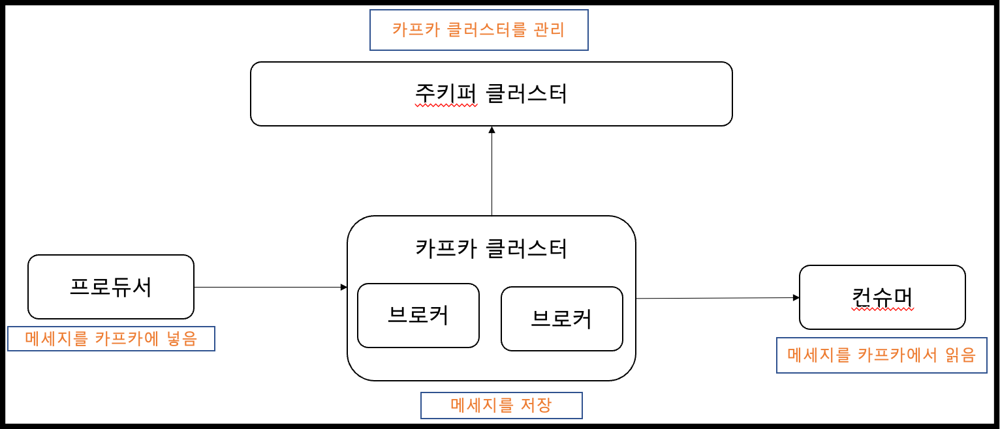
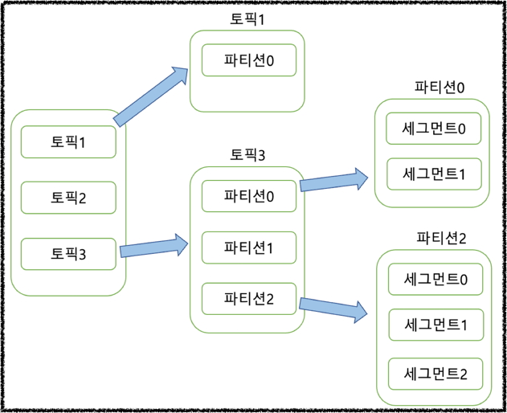

# 3장 카프카 기본 개념과 구조

## 1. 카프카 기본 개념

- 1-1. 주키퍼(Zookeeper): 카프카의 메타데이터를 관리 하고 브로커의 상태를 점검하는 어플리케이션

- 1-2. 카프카(Kafk a): 프로듀서와 컨슈머 사이에서 메시지를 중개하는 메시지 브로커 어플리케이션

- 1-3. 브로커(Broker): 카프카가 설치되고 동작하는 서버 또는 노드

- 1-4. 프로듀서(Producer): 카프카로 메시지를 보내는 클라이언트

- 1-5. 컨슈머(Consumer): 카프카에서 메시지를 가져가는 클라이언트

- 1-6. 토픽(Topic): 카프카 메시지를 구분하는 카테고리. 카프카 내에서 고유하다.

- 1-7. 파티션(Partition): 병렬 처리를 위해 토픽을 나눈 것

- 1-8. 세그먼트(Segment): 메시지가 저장된 브로커의 디스크 파일

- 1-9. 메시지(Message):  또는 레코드(Record): 프로듀서가 전송하고 컨슈머가 가져가는 데이터 조각.

## 2. 카프카 기본 구성

- **2-1 리플리케이션**   
   - 리플리케이션이란 메시지를 복제해서 여러 브로커에 분산 저장하는 것을 의미한다. 이 덕분에 하나의 브로커에서 장애가 발생 하더라고, 안정성을 유지 할 수 있다. 리플리케이션의 개수를 설정할 수 있는데, 수가 많아질수록 안정성은 올라가지만 리소스를 많이 사용하므로 적절한 개수를 설정해주어야 한다. 
일반적으로 테스트/개발환경에서는 그 1로 설정한다. 
운영에서는 로그와 같이 유실이 허용되는 경우 2로 설정하고, 
유실을 최소화 해야하는 경우에는 3으로 설정을 한다.


- **2-2 파티션**   
   - 하나의 토픽을 병렬 처리하기위해 나누어 둔 것을 파티션이라고 한다. 이렇게 나누어진 파티션의 수 만큼 컨슈머를 연결하여 병렬로 처리할 수 있다. 파티션의 수는 언제든지 늘릴 수 있지만, 한번 늘린 파티션의 수를 줄일 수는 없기때문에 작게 시작해서 천천히 늘려가는 것이 좋다.
- **2-3 세그먼트**   
   - 이전 실습에서 환경을 구성하고 메시지를 하나 보냈었다. 이 메시지는 kisu-overview 토픽의 파티션 0에 저장되어 있을 것이다. 그리고 이 저장되어있는 파일을 세그먼트라고 한다.

## 3. 카프카 특징

- 3-1분산 시스템 :
   - 카프카는 분산시스템으로 구성할 수 있도록 되어있다. 이 덕분에 카프카는 높은 처리 성능을 가지고있고 장애대응
도 탁월하다

- 3-2 페이지 캐시:
   - 매번 디스크에 I/O 접근을 하는 대신, 잔여 메모리를 활용하여 페이지캐시를 통해 데이터를 가져오고 뛰어난 처리
량을 달성하였다.

- 3-3 배치 전송 처리:
프로듀서-브로커, 브로커-컨슈머 간에 메시지를 주고받을 때 배치처리를 활용하여 효율적인 리소스 사용은 지원 한다.

- 3-4 압축 전송: 
   - 카프카는 다양한 타입의 압축 전송을 지원하여, 효율적인 네트워크 사용을 도와준다.
압축타입은 총 4가지 gzip, snappy, lz4, zstd이고 높은 압축률이 필요한 경우 gzip이나 zstd를 권장
빠른 응답속도의 압축은 snappy, lz4 를 권장.

- 3-5 토픽, 파티션, 오프셋: 
   - 카프카는 메시지를 토픽으로 구분하고, 병렬처리를 위해 파티션을 사용한다. 그리고 각
파티션은 오프셋을 가지고 있어서 메시지의 순서를 보장한다.

- 3-6 고가용성 보장:
   - 리플리케이션으로 파티션들은 복제하여 저장함으로서, 하나의 브로커에서 장애가 발생해도 나
머지 브로커에서 메시지를 처리할 수 있도록하여 고가용성을 보장한다.

- 3-7 주키퍼 의존성:
   - 주키퍼를 이용해 카프카의 메타 정보를 관리하고 브로커의 상태를 관리한다. 주키퍼는 과반수
이상 유지되어야 해서 홀수 구성이 좋다.
